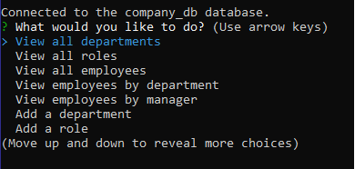
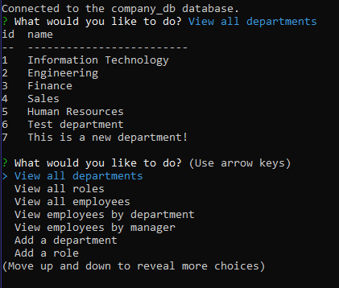
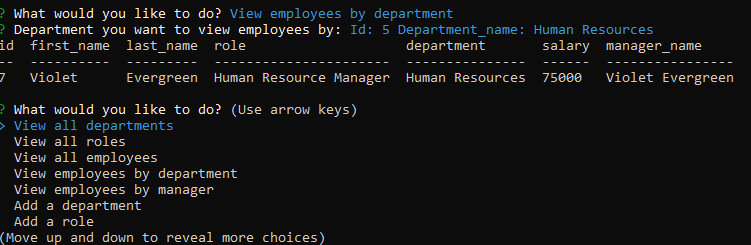
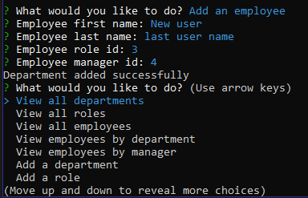

# Employee Tracker [](https://opensource.org/licenses/MIT)
  

## Description
Tracks your employees in a mySQL database. View and add departments, employees and roles on the command line

Menu



Viewing departments



Viewing employees by department



Adding employees


  

## Table of Contents
- [Installation](#installation)
  
- [Usage](#usage)
  
- [License](#license)

-[Video](#video)
  

## Installation
To install the necessary dependencies, run the following command:
```
  npm i
```
  

## Usage
You can create a new user with the following details - user: user and password: password123. These can be changed in app.js. Alternatively you can type npm start [username] [password] to login to the mysql database. In the db folder, there is also a schema.sql and seeds.sql file to create the database, tables and some test data
  

## License
This project is licensed under the [MIT](https://opensource.org/licenses/MIT) license

## Video
https://watch.screencastify.com/v/mZFbEUTCg3r7PnjtVJJt
